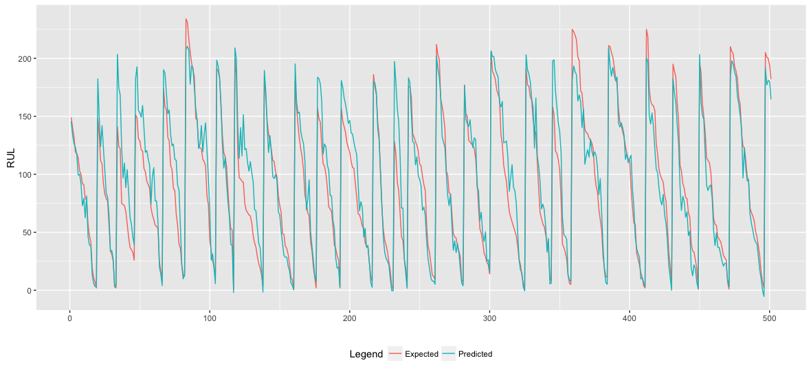
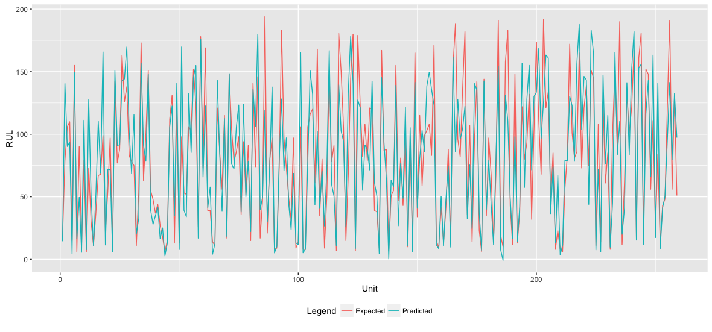
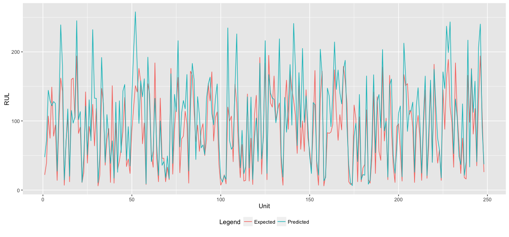

```{r setup, include=FALSE}
knitr::opts_chunk$set(echo = TRUE)
```

## About the Data
In this report we use Turbofan Engine data provided by the Prognostics CoE at NASA Ames:  <https://ti.arc.nasa.gov/tech/dash/pcoe/prognostic-data-repository/>.

The data was simulated using C-MAPSS, four engines were run under different operating conditions and fault modes until failure.
The bundle of data contained four sets of training data and four sets of testing data. The training data contained sensor data for the entire life of the engine while the test data stops before the engine dies.

Here is a quick look at the data:
```{r turbofanData, echo=TRUE}
#loading in a set of training data
train_data = read.table("TurboFanData/train_FD001.txt")

#Display a small portion of the training data
head(train_data)

#loading in a set of testing data
test_data = read.table("TurboFanData/test_FD001.txt")

#Display a small portion of the testing data
head(test_data)
```
Each set of data, both training and testing have twenty-six columns. They are as follows:

1 - unit number

2	- time, in cycles

3	- operational setting 1

4	- operational setting 2

5	- operational setting 3

6	- sensor measurement  1

7	- sensor measurement  2 

...
  
26 - sensor measurement  26


Each set of data has a set amount of units (column 1), these units are seperate from each other and can have their own RULs predicted. You could look at them as if they were several different components within the engine.

## Method for predicting RUL
As most data driven methods of predicting RUL our method consists of a training phase and a testing phase.

Our training phase consists of three segments and uses an ensemble of models to predict RUL. First, we must split the trianing data accordingly, the first segment is where we create the initial models these models will take about seventy-five percent of the training data. This data is fed into several machine learning algorithms to produce a collection of models from the data. For this step we decided to usea  multilayered perceptrons (MLP) and a radial basis function (RBF). Next, fifteen percent goes back into the models we just created to have their RULs predicted, this will produce an RUL for each model. These models are combined by feeding them through another multilayered perceptron to create the ensemble model. The final segment is validation, we take the remaining ten percent of the data and predict its RUL to validate that our models are accurate.

Before feeding any of the data into the machine learning algorithms we needed to clean up our data and make it more suitable for use. To do this we removed all columns of the data that were constant in each of the three segments of the data and kept track of which columns we removed so that during the testing phase we could remove them before predicting RUL. Another thing we remove is the unit number column, we do this because we want to create a universal model, in otherwords we want to predict the RUL of any unit with this one model. The final adjustment that we made was to normalize each column of the training data to have a mean of zero and standard deviation of 1. Doing this preserves the shape of our data and eliminates most of the problems related to the magnitude of the data.

Below is a plot of a subset of the results from the validation stage. The data set FD001 from the turbofan data collection was used to train the model and produce this validation data. Only a subset is displayed because the output is too large to be understood visually.
```{r validation, echo=FALSE}
# This is the code to plot the graph with the rspatiotemp project

# library(ggplot2)
# library(dplyr)
# library(tidyr)
# FD1 = read.table("TurboFanData/train_FD001.txt")
# ensModel1 = createModel.ens.h2o(FD1)
# Expected = ensModel1$validateRUL[500:1000]
# Predicted = ensModel1$validate[500:1000]
# Time = 1:length(Predicted)
# dat = data.frame(t = Time, cbind(Predicted,Expected))
# ggplot(dat %>% gather(Legend, value, -t)) + geom_line(aes(x = t, y = value, colour = Legend)) + theme(legend.position = "bottom") + labs(x = "", y = "RUL")
```

As you can see the general shape and magnitude of the expected and predicted values are very similar. This indicates that our method of computing RUL work pretty well with the validation data. 

The testing phase of our method starts with a similar clean up method used in the training phase. First, the columns removed in the training phase are removed test data. Next, the data is scaled using the mean and standard deviation of each column in the training data. From there the data is fed into the initial models and those results are fed into the ensemble model to produced and estimated RUL.

## Results
In the TurboFan Engine data collection there were four test data sets with a set number of units, each units actual RUL was also saved in a seperate file. Now using our method explained above, we will attempt to predict the RUL of each unit in each of the four test data sets.

First test data set: 100 units, 0% dropout, 0 past values used, **MSE = 663.8576**
```{r results1_0_0, echo=FALSE}
# This is the code to create the model and predict the RUL using the rspatiotemp project

# library(ggplot2)
# library(dplyr)
# library(tidyr)
FD1 = read.table("TurboFanData/train_FD001.txt")
test1 = read.table("TurboFanData/test_FD001.txt")
ensModel1 = createModel.ens.h2o(FD1)
i = sapply(1:max(test1[,1]),function(x){
  w = which(test1[,1]==x)
  max(w)
})
Predicted = predict.ens.h2o(test1[i,],ensModel1)
Expected = as.numeric(unlist(read.table("TurboFanData/RUL_FD001.txt")))
Unit = 1:length(Predicted)
dat = data.frame(t = Unit, cbind(Predicted,Expected))
ggplot(dat %>% gather(Legend, value, -t)) + geom_line(aes(x = t, y = value, colour = Legend)) + theme(legend.position = "bottom") + labs(x = "Unit", y = "RUL")
```
FD1 = read.table("TurboFanData/train_FD001.txt")
test1 = read.table("TurboFanData/test_FD001.txt")
ensModel1 = createModel.ens.h2o(FD1)
Predicted = predict.ens.h2o(test1,ensModel1)
Expected = as.numeric(unlist(read.table("TurboFanData/RUL_FD001.txt")))
Expected = foreach(i = 1:length(Expected), .combine = 'c', .inorder = TRUE) %do% {
(length(which(test1[,1] == i))+Expected[i]-1):Expected[i]
}
Unit = 1:length(Predicted)
dat = data.frame(t = Unit, cbind(Predicted,Expected))
ggplot(dat %>% gather(Legend, value, -t)) + geom_line(aes(x = t, y = value, colour = Legend)) + theme(legend.position = "bottom") + labs(x = "Unit", y = "RUL")

error = (Expected-Predicted)^2
rmsError = foreach(i = 1:length(table(test1[,1])),.combine = 'c') %do% {
  sum(error[which(test1[,1] == i)])/length(which(test1[,1]==i))
}

hist(rmsError, freq=FALSE)
lines(density(rmsError), col="red")


Second test data set: 259 units, 0% dropout, 0 past values used, **MSE = 785.3838**
```{r results2_0_0, echo=FALSE}
# This is the code to create the model and predict the RUL using the rspatiotemp project

# library(ggplot2)
# library(dplyr)
# library(tidyr)
# FD2 = read.table("TurboFanData/train_FD002.txt")
# test2 = read.table("TurboFanData/test_FD002.txt")
# ensModel2 = createModel.ens.h2o(FD2)
# i = sapply(1:max(test2[,1]),function(x){
#   w = which(test2[,1]==x)
#   max(w)
# })
# Predicted = predict.ens.h2o(test2[i,],ensModel2)
# Expected = as.numeric(unlist(read.table("TurboFanData/RUL_FD002.txt")))
# Unit = 1:length(Predicted)
# dat = data.frame(t = Unit, cbind(Predicted,Expected))
# ggplot(dat %>% gather(Legend, value, -t)) + geom_line(aes(x = t, y = value, colour = Legend)) + theme(legend.position = "bottom") + labs(x = "Unit", y = "RUL")
```



Third test data set: 100 units, 0% dropout, 0 past values used, **MSE = 1815.95**
```{r results3_0_0, echo=FALSE}
# This is the code to create the model and predict the RUL using the rspatiotemp project

# library(ggplot2)
# library(dplyr)
# library(tidyr)
# FD3 = read.table("TurboFanData/train_FD003.txt")
# test3 = read.table("TurboFanData/test_FD003.txt")
# ensModel3 = createModel.ens.h2o(FD3)
# i = sapply(1:max(test3[,1]),function(x){
#   w = which(test3[,1]==x)
#   max(w)
# })
# Predicted = predict.ens.h2o(test3[i,],ensModel3)
# Expected = as.numeric(unlist(read.table("TurboFanData/RUL_FD003.txt")))
# Unit = 1:length(Predicted)
# dat = data.frame(t = Unit, cbind(Predicted,Expected))
# ggplot(dat %>% gather(Legend, value, -t)) + geom_line(aes(x = t, y = value, colour = Legend)) + theme(legend.position = "bottom") + labs(x = "Unit", y = "RUL")
```


Fourth test data set: 249 units, 0% dropout, 0 past values used, **MSE = 1638.789**
```{r results4_0_0, echo=FALSE}
# This is the code to create the model and predict the RUL using the rspatiotemp project

# library(ggplot2)
# library(dplyr)
# library(tidyr)
# FD4 = read.table("TurboFanData/train_FD004.txt")
# test4 = read.table("TurboFanData/test_FD004.txt")
# ensModel4 = createModel.ens.h2o(FD4)
# i = sapply(1:max(test4[,1]),function(x){
#   w = which(test4[,1]==x)
#   max(w)
# })
# Predicted = predict.ens.h2o(test4[i,],ensModel4)
# Expected = as.numeric(unlist(read.table("TurboFanData/RUL_FD004.txt")))
# Unit = 1:length(Predicted)
# dat = data.frame(t = Unit, cbind(Predicted,Expected))
# ggplot(dat %>% gather(Legend, value, -t)) + geom_line(aes(x = t, y = value, colour = Legend)) + theme(legend.position = "bottom") + labs(x = "Unit", y = "RUL")
```



First test data set: 100 units, 20% dropout, 0 past values used, **MSE = 658.7348**
```{r results1_0.2_0, echo=FALSE}
# This is the code to create the model and predict the RUL using the rspatiotemp project

# library(ggplot2)
# library(dplyr)
# library(tidyr)
# FD1 = read.table("TurboFanData/train_FD001.txt")
# test1 = read.table("TurboFanData/test_FD001.txt")
# ensModel1 = createModel.ens.h2o(FD1,inputDropout = 0.2)
# i = sapply(1:max(test1[,1]),function(x){
#   w = which(test1[,1]==x)
#   max(w)
# })
# Predicted = predict.ens.h2o(test1[i,],ensModel1)
# Expected = as.numeric(unlist(read.table("TurboFanData/RUL_FD001.txt")))
# Unit = 1:length(Predicted)
# dat = data.frame(t = Unit, cbind(Predicted,Expected))
# ggplot(dat %>% gather(Legend, value, -t)) + geom_line(aes(x = t, y = value, colour = Legend)) + theme(legend.position = "bottom") + labs(x = "Unit", y = "RUL")
```


Second test data set: 259 units, 20% dropout, 0 past values used, **MSE = 820.6926**
```{r results2_0.2_0, echo=FALSE}
# This is the code to create the model and predict the RUL using the rspatiotemp project

# library(ggplot2)
# library(dplyr)
# library(tidyr)
# FD2 = read.table("TurboFanData/train_FD002.txt")
# test2 = read.table("TurboFanData/test_FD002.txt")
# ensModel2 = createModel.ens.h2o(FD2,inputDropout = 0.2)
# i = sapply(1:max(test2[,1]),function(x){
#   w = which(test2[,1]==x)
#   max(w)
# })
# Predicted = predict.ens.h2o(test2[i,],ensModel2)
# Expected = as.numeric(unlist(read.table("TurboFanData/RUL_FD002.txt")))
# Unit = 1:length(Predicted)
# dat = data.frame(t = Unit, cbind(Predicted,Expected))
# ggplot(dat %>% gather(Legend, value, -t)) + geom_line(aes(x = t, y = value, colour = Legend)) + theme(legend.position = "bottom") + labs(x = "Unit", y = "RUL")
```


Third test data set: 100 units, 20% dropout, 0 past values used, **MSE = 1894.458**
```{r results3_0.2_0, echo=FALSE}
# This is the code to create the model and predict the RUL using the rspatiotemp project

# library(ggplot2)
# library(dplyr)
# library(tidyr)
# FD3 = read.table("TurboFanData/train_FD003.txt")
# test3 = read.table("TurboFanData/test_FD003.txt")
# ensModel3 = createModel.ens.h2o(FD3,inputDropout = 0.2)
# i = sapply(1:max(test3[,1]),function(x){
#   w = which(test3[,1]==x)
#   max(w)
# })
# Predicted = predict.ens.h2o(test3[i,],ensModel3)
# Expected = as.numeric(unlist(read.table("TurboFanData/RUL_FD003.txt")))
# Unit = 1:length(Predicted)
# dat = data.frame(t = Unit, cbind(Predicted,Expected))
# ggplot(dat %>% gather(Legend, value, -t)) + geom_line(aes(x = t, y = value, colour = Legend)) + theme(legend.position = "bottom") + labs(x = "Unit", y = "RUL")
```


Fourth test data set: 249 units, 20% dropout, 0 past values used, **MSE = 1695.745**
```{r results4_0.2_0, echo=FALSE}
# This is the code to create the model and predict the RUL using the rspatiotemp project

# library(ggplot2)
# library(dplyr)
# library(tidyr)
# FD4 = read.table("TurboFanData/train_FD004.txt")
# test4 = read.table("TurboFanData/test_FD004.txt")
# ensModel4 = createModel.ens.h2o(FD4,inputDropout = 0.2)
# i = sapply(1:max(test4[,1]),function(x){
#   w = which(test4[,1]==x)
#   max(w)
# })
# Predicted = predict.ens.h2o(test4[i,],ensModel4)
# Expected = as.numeric(unlist(read.table("TurboFanData/RUL_FD004.txt")))
# Unit = 1:length(Predicted)
# dat = data.frame(t = Unit, cbind(Predicted,Expected))
# ggplot(dat %>% gather(Legend, value, -t)) + geom_line(aes(x = t, y = value, colour = Legend)) + theme(legend.position = "bottom") + labs(x = "Unit", y = "RUL")
```


First test data set: 100 units, 0% dropout, 1 past values used, **MSE = **
```{r results1_0_1, echo=FALSE}
# This is the code to create the model and predict the RUL using the rspatiotemp project

# library(ggplot2)
# library(dplyr)
# library(tidyr)
# FD1 = read.table("TurboFanData/train_FD001.txt")
# test1 = read.table("TurboFanData/test_FD001.txt")
# ensModel1 = createModel.ens.h2o(FD1,numPastVal = 1)
# i = sapply(1:max(test1[,1]),function(x){
#   w = which(test1[,1]==x)
#   c(max(w)-1,max(w))
# })
# i = as.vector(i)
# Predicted = predict.ens.h2o(test1[i,],ensModel1)
# Expected = as.numeric(unlist(read.table("TurboFanData/RUL_FD001.txt")))
# Unit = 1:length(Predicted)
# dat = data.frame(t = Unit, cbind(Predicted,Expected))
# ggplot(dat %>% gather(Legend, value, -t)) + geom_line(aes(x = t, y = value, colour = Legend)) + theme(legend.position = "bottom") + labs(x = "Unit", y = "RUL")
```


Second test data set: 259 units, 0% dropout, 1 past values used, **MSE = **
```{r results2_0_1, echo=FALSE}
# This is the code to create the model and predict the RUL using the rspatiotemp project

# library(ggplot2)
# library(dplyr)
# library(tidyr)
# FD2 = read.table("TurboFanData/train_FD002.txt")
# test2 = read.table("TurboFanData/test_FD002.txt")
# ensModel2 = createModel.ens.h2o(FD2,numPastVal = 1)
# i = sapply(1:max(test2[,1]),function(x){
#   w = which(test2[,1]==x)
#   c(max(w)-1,max(w))
# })
# i = as.vector(i)
# Predicted = predict.ens.h2o(test2[i,],ensModel2)
# Expected = as.numeric(unlist(read.table("TurboFanData/RUL_FD002.txt")))
# Unit = 1:length(Predicted)
# dat = data.frame(t = Unit, cbind(Predicted,Expected))
# ggplot(dat %>% gather(Legend, value, -t)) + geom_line(aes(x = t, y = value, colour = Legend)) + theme(legend.position = "bottom") + labs(x = "Unit", y = "RUL")
```


Third test data set: 100 units, 0% dropout, 1 past values used, **MSE = **
```{r results3_0_1, echo=FALSE}
# This is the code to create the model and predict the RUL using the rspatiotemp project

# library(ggplot2)
# library(dplyr)
# library(tidyr)
# FD3 = read.table("TurboFanData/train_FD003.txt")
# test3 = read.table("TurboFanData/test_FD003.txt")
# ensModel3 = createModel.ens.h2o(FD3,numPastVal = 1)
# i = sapply(1:max(test3[,1]),function(x){
#   w = which(test3[,1]==x)
#   c(max(w)-1,max(w))
# })
# i = as.vector(i)
# Predicted = predict.ens.h2o(test3[i,],ensModel3)
# Expected = as.numeric(unlist(read.table("TurboFanData/RUL_FD003.txt")))
# Unit = 1:length(Predicted)
# dat = data.frame(t = Unit, cbind(Predicted,Expected))
# ggplot(dat %>% gather(Legend, value, -t)) + geom_line(aes(x = t, y = value, colour = Legend)) + theme(legend.position = "bottom") + labs(x = "Unit", y = "RUL")
```


Fourth test data set: 249 units, 0% dropout, 1 past values used, **MSE = **
```{r results4_0_1, echo=FALSE}
# This is the code to create the model and predict the RUL using the rspatiotemp project

# library(ggplot2)
# library(dplyr)
# library(tidyr)
# FD4 = read.table("TurboFanData/train_FD004.txt")
# test4 = read.table("TurboFanData/test_FD004.txt")
# ensModel4 = createModel.ens.h2o(FD4,numPastVal = 1)
# i = sapply(1:max(test4[,1]),function(x){
#   w = which(test4[,1]==x)
#   c(max(w)-1,max(w))
# })
# i = as.vector(i)
# Predicted = predict.ens.h2o(test4[i,],ensModel4)
# Expected = as.numeric(unlist(read.table("TurboFanData/RUL_FD004.txt")))
# Unit = 1:length(Predicted)
# dat = data.frame(t = Unit, cbind(Predicted,Expected))
# ggplot(dat %>% gather(Legend, value, -t)) + geom_line(aes(x = t, y = value, colour = Legend)) + theme(legend.position = "bottom") + labs(x = "Unit", y = "RUL")
```


The results from this method produce good and reasonable results most of the time with very little error.

